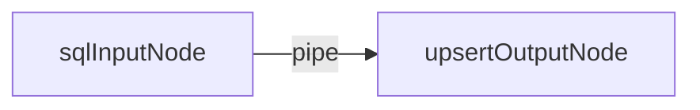
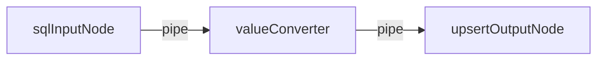
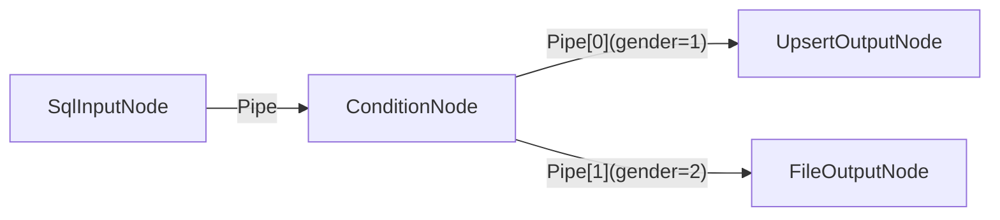

# Etl-engine

**中文** | [English](README.md)

## 🚀 Etl-engine: 高性能、轻量级 Headless ETL 引擎
Etl-engine 是一款高效轻量、且易于扩展的 Headless ETL 库。它专注于解决高并发、高性能的数据同步需求，是 Kettle (PDI) 等 ETL 工具在代码级集成场景下的理想替代方案。

-----

## 🔥 核心特性

**`Etl-engine`** 提供以下三大核心特性：

### 1. 极致的速度 ⚡️

通过批量操作和非阻塞的缓存管道设计，显著提升数据处理和数据库 I/O 速度。

📊 **实测数据：** 处理 $200,000$ 条数据的插入/更新任务，`etl-engine` 的速度是 **Kettle 的 2 倍左右**。

**Kettle:**


**Etl-engine:**


### 2. 运行稳健可靠 🛡️

- 异常自愈：数据传输过程中遇到异常不会中断，支持自动重试，确保长任务的平稳运行。
- 全链路日志：详细的执行指标监控，方便进行调试。

### 3. 轻量且易于扩展 🧩

核心仅由 **Node(节点)** , **Pipe(管道)** , **Dataflow(数据流)** 3个主要组件构成，所有数据加载逻辑都抽象为可扩展的**节点**。除了内置的JDBC数据源节点，用户可以轻松继承基类，快速开发新的数据源（如 Http、Redis）或自定义转换逻辑，满足特定的业务需求。

-----

## 🛠️ 使用示例

以下代码展示了如何快速构建一个将 **Oracle 数据（抽取）** 通过 **Upsert 方式同步到 PostgreSQL（加载）** 的 ETL 任务。

### 1\. 一个表输入到一个表输出



```java

//创建Oracle数据源
DataSource dataSourceOracle = DataSourceUtil.getOracleDataSource();
//创建表输入节点
SqlInputNode sqlInputNode = new SqlInputNode(dataSourceOracle, "select * from t_resident_info");

//创建Postgres数据源
DataSource dataSourcePG = DataSourceUtil.getPostgresDataSource();
//创建插入/更新节点
UpsertOutputNode upsertOutputNode = new UpsertOutputNode(dataSourcePG, "t_resident_info", 1000);
//设置唯一标识(主键)映射，用于判断 Insert 或 Update
upsertOutputNode.setIdentityMapping(Arrays.asList(new Tuple2<>("ID", "ID")));

//创建管道，并设定缓冲区为1000条数据
Pipe pipe = new Pipe(1000);
//连接表输入和输出节点
pipe.connect(sqlInputNode, upsertOutputNode);

//创建数据流实例
Dataflow dataflow = new Dataflow(sqlInputNode);
//启动数据流，并设定5分钟后超时
dataflow.syncStart(5, TimeUnit.MINUTES);
```

### 2\. 一个sql输入节点经过字段值转换到一个输出节点


#### ValueConversionNode.java:
```java
package io.github.add2ws.node;

import lombok.NonNull;
import lombok.extern.slf4j.Slf4j;
import org.liuneng.base.MiddleNode;
import org.liuneng.base.Row;
import org.liuneng.exception.NodeException;

@Slf4j
public class ValueConversionNode extends MiddleNode {

    @Override
    protected @NonNull Row process(@NonNull Row row) throws NodeException {
        //将gender列值转换到gender_name列中
        if ("1".equals(row.get("gender"))) {
            row.put("gender_name", "male");
        } else {
            row.put("gender_name", "female");
        }

        //将address列值脱敏处理
        String address = String.valueOf(row.get("address"));
        if (address != null) {
            String masked = address.replaceAll("^(.).*(.)$", "$1***$2");
            row.put("address", masked);
        }

        return row;
    }

    @Override
    public String[] getColumns() throws NodeException {
        //为后续新增gender_name列
        return new String[]{"gender_name"};
    }

    @Override
    public @NonNull Type getType() {
        //中间节点类型：当后续连接多个节点时，对途径的数据流是拷贝还是分发
        return Type.COPY;
    }

}
```

#### Main:
```java
// 创建Oracle数据源和表输入节点
DataSource dataSourceOracle = DataSourceUtil.getOracleDataSource();
String sql = "SELECT * FROM ETL_BASE.T_RESIDENT_INFO WHERE 1=1 AND ROWNUM < 50000";
SqlInputNode sqlInputNode = new SqlInputNode(dataSourceOracle, sql);

// 创建Postgres数据源和表输出节点
DataSource dataSourcePG = DataSourceUtil.getPostgresDataSource();
UpsertOutputNode upsertOutputNode = new UpsertOutputNode(dataSourcePG, "t_resident_info", 1000);
upsertOutputNode.setIdentityMapping(Arrays.asList(new Tuple2<>("ID", "ID")));

// 创建值转换节点
ValueConversionNode valueConversionNode = new ValueConversionNode();

// 连接Oracle数据源输入节点和值转换节点
Pipe pipe = new Pipe(10000);
pipe.connect(sqlInputNode, valueConversionNode);

// 连接值转换节点和Postgres表输出节点
pipe = new Pipe(10000);
pipe.connect(valueConversionNode, upsertOutputNode);

// 启动数据流
Dataflow dataflow = new Dataflow(sqlInputNode);
dataflow.syncStart(5, TimeUnit.MINUTES);
```

### 3\. 一个sql输入节点经过列值判断将数据流分发到不同的输出节点


#### ConditionNode.java:
```java
package io.github.add2ws.node;

import lombok.NonNull;
import org.liuneng.base.MiddleNode;
import org.liuneng.base.Row;
import org.liuneng.exception.NodeException;

public class ConditionNode extends MiddleNode {

    @Override
    protected @NonNull Row process(@NonNull Row row) throws NodeException {

        Object gender = row.get("gender");
        if ("1".equals(gender)) {
            // 将gender=1的数据分发到第1个后续管道
            row.setPipeIndex(0);
            return row;
        } else {
            // 否则分发到第2个后续管道
            row.setPipeIndex(1);
            return row;
        }
    }

    @Override
    public String[] getColumns() throws NodeException {
        // 后续无新增列
        return new String[0];
    }

    @Override
    public @NonNull Type getType() {
        // 中间节点类型：当后面连接多个节点时，对途径的数据流是拷贝还是分发
        return Type.SWITCH;
    }
}

```

#### Main.java:
```java

    // 创建Oracle数据源和表输入节点
    DataSource dataSourceOracle = DataSourceUtil.getOracleDataSource();
    String sql = "SELECT * FROM ETL_BASE.T_RESIDENT_INFO WHERE 1=1 AND ROWNUM < 50000";
    SqlInputNode sqlInputNode = new SqlInputNode(dataSourceOracle, sql);

    // 创建Postgres数据源和表输出节点
    DataSource dataSourcePG = DataSourceUtil.getPostgresDataSource();
    UpsertOutputNode upsertOutputNode = new UpsertOutputNode(dataSourcePG, "t_resident_info", 1000);
    upsertOutputNode.setIdentityMapping(Arrays.asList(new Tuple2<>("ID", "ID")));

    // 创建csv文件输出节点
    FileOutputNode fileOutputNode = new FileOutputNode("D:/t_resident_info_female_" + System.currentTimeMillis() +".csv", FileOutputNode.Format.CSV);

    // 创建中间节点
    ConditionNode conditionNode = new ConditionNode();

    // 连接Oracle数据源输入节点
    Pipe pipe = new Pipe(10000);
    pipe.connect(sqlInputNode, conditionNode);

    // 连接中间节点和Postgres表输出节点
    pipe = new Pipe(10000);
    pipe.connect(conditionNode, upsertOutputNode);

    // 连接中间节点和csv文件输出节点
    pipe = new Pipe(10000);
    pipe.connect(conditionNode, fileOutputNode);

    // 启动数据流
    Dataflow dataflow = new Dataflow(sqlInputNode);
    dataflow.syncStart(5, TimeUnit.MINUTES);
```

-----

## 🏗️ 架构概览

`Etl-engine` 核心仅由以下3个主要组件构成：

* **Node (节点):** 数据的起点、终点和数据转换逻辑载体。
* **Pipe (管道):** 负责在节点间传递数据的非阻塞缓存队列。
* **Dataflow (数据流):** 任务的编排器和执行入口。
