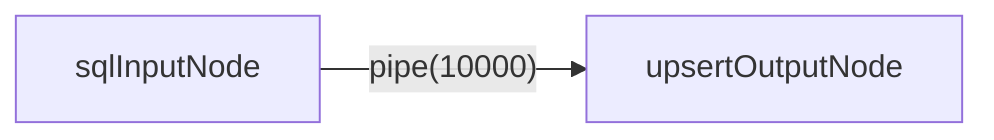
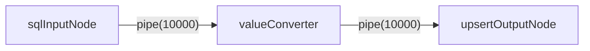
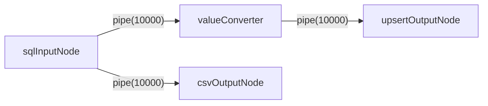

# Etl-engine 

**中文** | [English](README.en.md)

## 🚀 简介：高性能 ETL 引擎

**`Etl-engine`** 是一个轻量、稳健、易扩展的面向开发者的 ETL（抽取、转换、加载）库，旨在成为 **Kettle (PDI) 的高性能替代方案。

-----

## 🔥 核心优势

**`Etl-engine`** 提供以下三大核心特性：

### 1. 极致的速度 ⚡️

通过批量操作和非阻塞的缓存管道设计，显著提升数据处理和数据库 I/O 速度。

📊 **实测数据：** 处理 $200,000$ 条数据的插入/更新任务，`etl-engine` 的速度是 **Kettle 的 $\mathbf{2}$ 倍左右**。

**Kettle:**


**Etl-engine:**


### 2. 运行稳健可靠 🛡️

数据流传输过程中如果遇到异常不会马上停止，可以配置重试次数，自动尝试重新读取或写入数据。

### 3. 轻量且易于扩展 🧩

核心仅由 **Node(节点)** , **Pipe(管道)** , **Dataflow(数据流)** 3个主要组件构成，所有数据加载逻辑都抽象为可扩展的**节点**。除了内置的JDBC数据源节点，用户可以轻松继承基类，快速开发新的数据源（如 Http、Redis）或自定义转换逻辑，满足特定的业务需求。

-----

## 🛠️ 使用示例

以下代码展示了如何快速构建一个将 **Oracle 数据（抽取）** 通过 **Upsert 方式同步到 PostgreSQL（加载）** 的 ETL 任务。

### 1. 一个表输入到一个表输出



```java
// 1. 获取数据源
DataSource dataSourceOracle = DataSourceUtil.getOracleDataSource();
DataSource dataSourcePG = DataSourceUtil.getPostgresDataSource();

// 2. 创建输入节点
SqlInputNode sqlInputNode = new SqlInputNode(dataSourceOracle, "select * from t_resident_info");

// 3. 创建插入/更新节点
// 批量大小 1000
UpsertOutputNode upsertOutputNode = new UpsertOutputNode(dataSourcePG, "t_resident_info", 1000);
// 设置唯一标识映射，用于判断 Insert 或 Update
upsertOutputNode.setIdentityMapping(Arrays.asList(new Tuple2<>("ID", "ID")));

// 4. 创建管道并连接节点
Pipe pipe = new Pipe(1000); // 管道缓存大小 1000
pipe.connect(sqlInputNode, upsertOutputNode);

// 5. 启动数据流
Dataflow dataflow = new Dataflow(sqlInputNode);
dataflow.syncStart(5, TimeUnit.MINUTES); // 设置超时时间
```

### 2. 一个表输入经过字段值转换到一个表输出



```java
//todo
```

### 3. 一个表输入到多个输出



```java
//todo
```

-----

## 🏗️ 架构概览

`Etl-engine` 核心仅由以下3个主要组件构成：

* **Node (节点):** 数据的起点、终点和数据转换逻辑载体。
* **Pipe (管道):** 负责在节点间传递数据的非阻塞缓存队列。
* **Dataflow (数据流):** 任务的编排器和执行入口。
