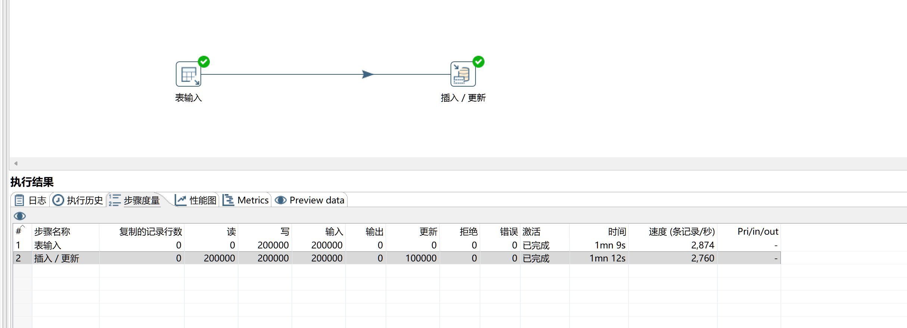
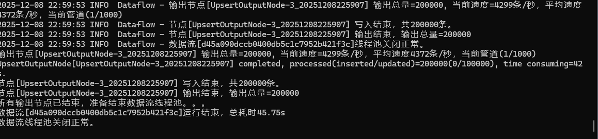
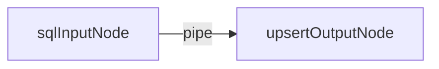
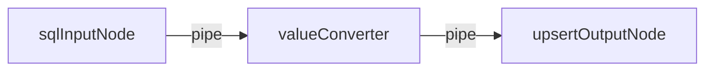
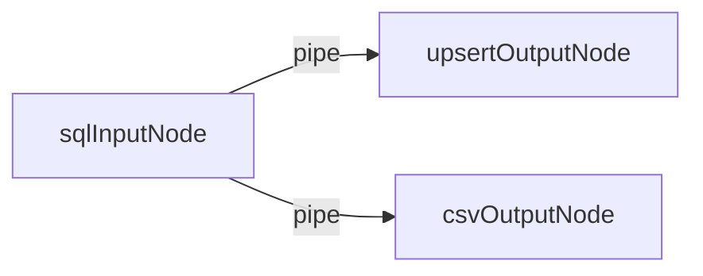

# Etl-engine
 [中文](README.md) | **English**

## 🚀 Introduction: High-Performance ETL Engine

**`Etl-engine`** is a lightweight, robust, and easily extensible ETL (Extract, Transform, Load) library for developers, designed to be **a high-performance alternative to Kettle (PDI)**.

-----

## 🔥 Core Advantages

**`Etl-engine`** provides the following three core features:

### 1\. Extreme Speed ⚡️

Significant improvement in data processing and database I/O speeds through **batch operations** and a **non-blocking, cached pipeline design**.

📊 **Real-World Test:** For an insert/update task involving $200,000$ records, the speed of `etl-engine` is **$\mathbf{2}$ times faster than Kettle**.

**Kettle:**


**Etl-engine:**


### 2\. Robust and Stable Operation 🛡️

During the data flow transfer process, encountering an exception will not cause an immediate stop; it will **automatically attempt to re-read or re-write the data**.

### 3\. Easy to Extend and Customize 🧩

The core consists of only three main components: **Node**, **Pipe**, and **Dataflow** . All data loading logic is abstracted into extensible **Nodes**. In addition to the built-in JDBC data source Node, users can easily inherit the base class to quickly develop new data sources (such as Http, Redis) or custom transformation logic to meet specific business requirements.

-----

## 🛠️ Usage Example

The following code demonstrates how to quickly build an ETL task that **extracts data from Oracle** and **synchronizes (Upsert) it to PostgreSQL (Load)**.

### 1. A sql input to a table output



```java

//Create Oracle data source
DataSource dataSourceOracle = DataSourceUtil.getOracleDataSource();
//Create talbe output node
SqlInputNode sqlInputNode = new SqlInputNode(dataSourceOracle, "select * from t_resident_info");

//Create Postgres data source
DataSource dataSourcePG = DataSourceUtil.getPostgresDataSource();
//Create upsert output node
UpsertOutputNode upsertOutputNode = new UpsertOutputNode(dataSourcePG, "t_resident_info", 1000);
//Set the unique identifier (primary key) mapping, used to determine Insert or Update.
upsertOutputNode.setIdentityMapping(Arrays.asList(new Tuple2<>("ID", "ID")));

//Create a pipe and set the buffer size to 1,000 data rows.
Pipe pipe = new Pipe(1000);
//Connect the sql input node and table upsert node.
pipe.connect(sqlInputNode, upsertOutputNode);

//Create dataflow instance
Dataflow dataflow = new Dataflow(sqlInputNode);
//Start the data flow and set the timeout after 5 minutes.
dataflow.syncStart(5, TimeUnit.MINUTES);
```

### 2. A sql input passes through a field value transformation to a table output



```java
//todo
```

### 3. A sql input to multiple output



```java
//Create Oracle data source
DataSource oracleDataSource = DataSourceUtil.getOracleDataSource();
SqlInputNode sqlInputNode = new SqlInputNode(oracleDataSource, "select * from etl_base.t_resident_info where rownum<=50000 order by id");

//Create Postgres target data source
DataSource postgresDataSource = DataSourceUtil.getPostgresDataSource();
UpsertOutputNode upsertOutputNode = new UpsertOutputNode(postgresDataSource, "public.t_resident_info", 1000);
//Set the unique identifier (primary key) mapping, used to determine Insert or Update.
upsertOutputNode.setIdentityMapping(Arrays.asList(new Tuple2<>("ID","ID")));

//Create csv target file
FileOutputNode fileOutputNode = new FileOutputNode("E:/output_" + System.currentTimeMillis() + ".csv", FileOutputNode.Format.CSV);

//Create pipe and connect the Oracle data source and Postgres data source.
Pipe pipe = new Pipe(1000);
pipe.connect(sqlInputNode,upsertOutputNode);

//Create pipe and connect the Oracle data source and csv target file.
Pipe pipe_2 = new Pipe(1000);
pipe_2.connect(sqlInputNode,fileOutputNode);

//Create dataflow and startup.
Dataflow dataflow = new Dataflow(sqlInputNode);
dataflow.syncStart();
```

-----

## 🏗️ Architecture Overview

The core of **`Etl-engine`** consists of only the following three main components :

* **Node** The starting point, ending point, and carrier for data transformation logic.
* **Pipe** A non-blocking, cached queue responsible for transferring data between Nodes.
* **Dataflow** The orchestrator and execution entry point for the task.
