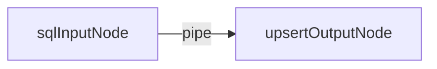
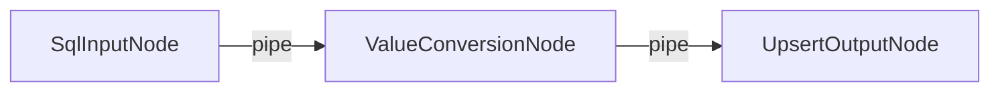
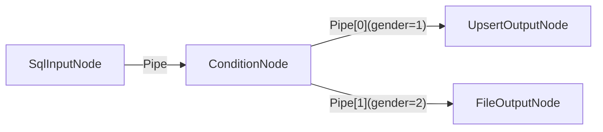

# Etl-engine
 [中文](README.cn.md) | **English**

## 🚀 Etl-engine: High-Performance, Lightweight Headless ETL Framework
Etl-engine is a lightweight, robust, and extensible Headless ETL library designed for developers. It focuses on high-concurrency and high-performance data synchronization, serving as the ideal code-level alternative to heavy, GUI-based ETL tools like Kettle (PDI).

-----

## 🔥 Core Feature

**`Etl-engine`** provides the following three core features:

### 1\. Extreme Speed ⚡️

Significant improvement in data processing and database I/O speeds through **batch operations** and a **non-blocking, cached pipeline design**.

📊 **Real-World Test:** For an insert/update task involving $200,000$ records, the speed of `etl-engine` is **$\mathbf{2}$ times faster than Kettle**.

**Kettle:**


**Etl-engine:**


### 2.Robust and Stable Operation 🛡️

- Self-Healing: Tasks do not crash on individual data errors; it supports automatic retries and error handling to ensure stable long-running jobs.

- Full-Link Logging: Provides detailed execution metrics for debugging.

### 3.Easy to Extend and Customize 🧩

The core consists of only three main components: **Node**, **Pipe**, and **Dataflow** . All data loading logic is abstracted into extensible **Nodes**. In addition to the built-in JDBC data source Node, users can easily inherit the base class to quickly develop new data sources (such as Http, Redis) or custom transformation logic to meet specific business requirements.

-----

## 🛠️ Usage Example

The following code demonstrates how to quickly build an ETL task that **extracts data from Oracle** and **synchronizes (Upsert) it to PostgreSQL (Load)**.

### 1\. One sql input to one table output



```java

//Create Oracle data source
DataSource dataSourceOracle = DataSourceUtil.getOracleDataSource();
//Create talbe output node
SqlInputNode sqlInputNode = new SqlInputNode(dataSourceOracle, "select * from t_resident_info");

//Create Postgres data source
DataSource dataSourcePG = DataSourceUtil.getPostgresDataSource();
//Create upsert output node
UpsertOutputNode upsertOutputNode = new UpsertOutputNode(dataSourcePG, "t_resident_info", 1000);
//Set the unique identifier (primary key) mapping, used to determine Insert or Update.
upsertOutputNode.setIdentityMapping(Arrays.asList(new Tuple2<>("ID", "ID")));

//Create a pipe and set the buffer size to 1,000 data rows.
Pipe pipe = new Pipe(1000);
//Connect the sql input node and table upsert node.
pipe.connect(sqlInputNode, upsertOutputNode);

//Create dataflow instance
Dataflow dataflow = new Dataflow(sqlInputNode);
//Start the data flow and set the timeout after 5 minutes.
dataflow.syncStart(5, TimeUnit.MINUTES);
```

### 2\. One SQL input node through field value conversion to one output node.


#### ValueConversionNode.java:
```java
package io.github.add2ws.node;

import lombok.NonNull;
import lombok.extern.slf4j.Slf4j;
import org.liuneng.base.MiddleNode;
import org.liuneng.base.Row;
import org.liuneng.exception.NodeException;

@Slf4j
public class ValueConversionNode extends MiddleNode {

    @Override
    protected @NonNull Row process(@NonNull Row row) throws NodeException {
        // Converting values from column 'gender' to 'gender_name'.
        if ("1".equals(row.get("gender"))) {
            row.put("gender_name", "male");
        } else {
            row.put("gender_name", "female");
        }

        // Masking values of column 'address'.
        String address = String.valueOf(row.get("address"));
        if (address != null) {
            String masked = address.replaceAll("^(.).*(.)$", "$1***$2");
            row.put("address", masked);
        }

        return row;
    }

    @Override
    public String[] getColumns() throws NodeException {
        //Adding column 'gender_name' for subsequent nodes.
        return new String[]{"gender_name"};
    }

    @Override
    public @NonNull Type getType() {
        //MiddleNode type: When connecting to multiple downstream nodes, 
        // determines whether the data stream is copied or distributed.
        return Type.COPY;
    }

}
```

#### Main:
```java
// Create Oracle data source and SQL input node
DataSource dataSourceOracle = DataSourceUtil.getOracleDataSource();
String sql = "SELECT * FROM ETL_BASE.T_RESIDENT_INFO WHERE 1=1 AND ROWNUM < 50000";
SqlInputNode sqlInputNode = new SqlInputNode(dataSourceOracle, sql);

// Create Postgres data source and table output node
DataSource dataSourcePG = DataSourceUtil.getPostgresDataSource();
UpsertOutputNode upsertOutputNode = new UpsertOutputNode(dataSourcePG, "t_resident_info", 1000);
upsertOutputNode.setIdentityMapping(Arrays.asList(new Tuple2<>("ID", "ID")));

// Create value conversion node
ValueConversionNode valueConversionNode = new ValueConversionNode();

// Connect Oracle input node to value conversion node
Pipe pipe = new Pipe(10000);
pipe.connect(sqlInputNode, valueConversionNode);

// Connect value conversion node to Postgres output node
pipe = new Pipe(10000);
pipe.connect(valueConversionNode, upsertOutputNode);

// Start dataflow
Dataflow dataflow = new Dataflow(sqlInputNode);
dataflow.syncStart(5, TimeUnit.MINUTES);
```


### 3\. One SQL input node distributes the data stream to multiple output nodes based on column value evaluation.


#### ConditionNode.java:
```java
package io.github.add2ws.node;

import lombok.NonNull;
import org.liuneng.base.MiddleNode;
import org.liuneng.base.Row;
import org.liuneng.exception.NodeException;

public class ConditionNode extends MiddleNode {

    @Override
    protected @NonNull Row process(@NonNull Row row) throws NodeException {

        Object gender = row.get("gender");
        if ("1".equals(gender)) {
            // Distribute data where gender=1 to the first downstream pipe
            row.setPipeIndex(0);
            return row;
        } else {
            // Otherwise, distribute to the second downstream pipe
            row.setPipeIndex(1);
            return row;
        }
    }

    @Override
    public String[] getColumns() throws NodeException {
        // No additional columns added
        return new String[0];
    }

    @Override
    public @NonNull Type getType() {
        // MiddleNode type: When connected to multiple downstream nodes, 
        // determines whether the data stream is copied or distributed.
        return Type.SWITCH;
    }
}

```

#### Main.java:
```java

    // Create Oracle data source and SQL input node
    DataSource dataSourceOracle = DataSourceUtil.getOracleDataSource();
    String sql = "SELECT * FROM ETL_BASE.T_RESIDENT_INFO WHERE 1=1 AND ROWNUM < 50000";
    SqlInputNode sqlInputNode = new SqlInputNode(dataSourceOracle, sql);

    // Create Postgres data source and table output node
    DataSource dataSourcePG = DataSourceUtil.getPostgresDataSource();
    UpsertOutputNode upsertOutputNode = new UpsertOutputNode(dataSourcePG, "t_resident_info", 1000);
    upsertOutputNode.setIdentityMapping(Arrays.asList(new Tuple2<>("ID", "ID")));

    // Create CSV file output node
    FileOutputNode fileOutputNode = new FileOutputNode("D:/t_resident_info_female_" + System.currentTimeMillis() +".csv", FileOutputNode.Format.CSV);

    // Create middle node
    ConditionNode conditionNode = new ConditionNode();

    // Connect Oracle input node
    Pipe pipe = new Pipe(10000);
    pipe.connect(sqlInputNode, conditionNode);

    // Connect middle node to Postgres output node
    pipe = new Pipe(10000);
    pipe.connect(conditionNode, upsertOutputNode);

    // Connect middle node to CSV file output node
    pipe = new Pipe(10000);
    pipe.connect(conditionNode, fileOutputNode);

    // Start dataflow
    Dataflow dataflow = new Dataflow(sqlInputNode);
    dataflow.syncStart(5, TimeUnit.MINUTES);
```

-----

## 🏗️ Architecture Overview

The core of **`Etl-engine`** consists of only the following three main components :

* **Node** The starting point, ending point, and carrier for data transformation logic.
* **Pipe** A non-blocking, cached queue responsible for transferring data between Nodes.
* **Dataflow** The orchestrator and execution entry point for the task.
